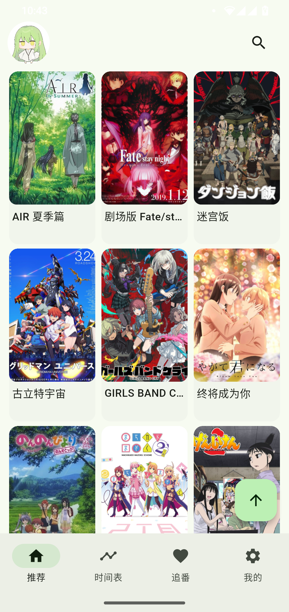
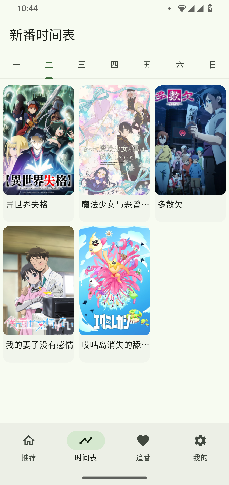
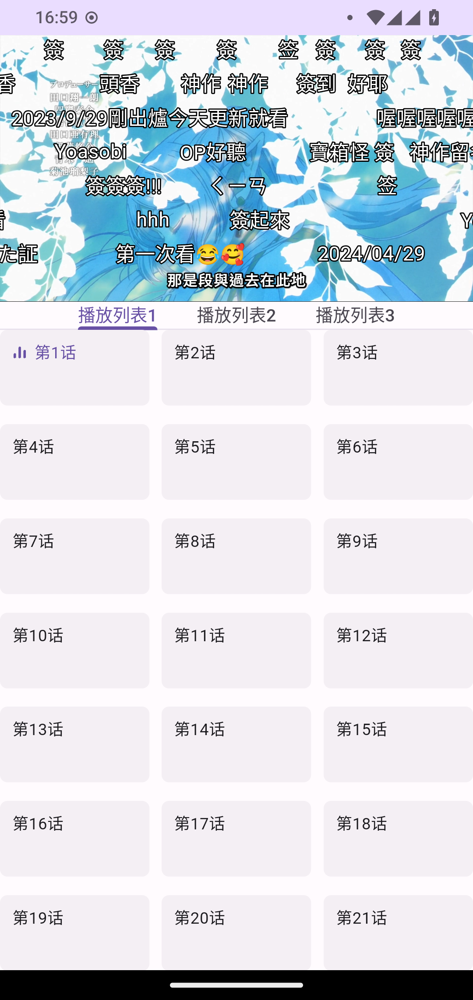
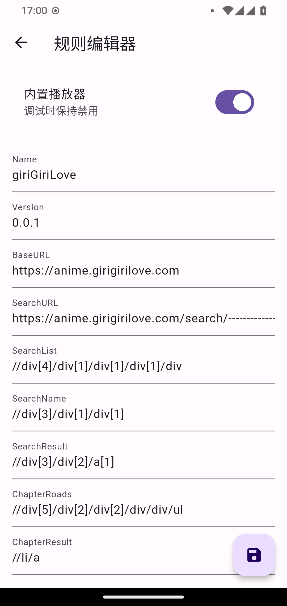
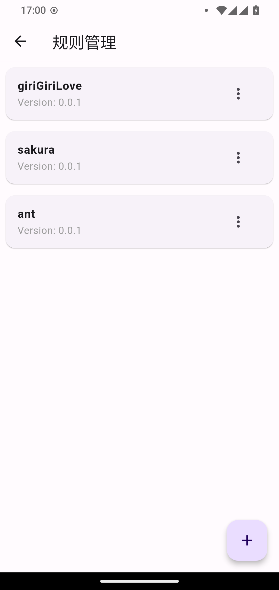
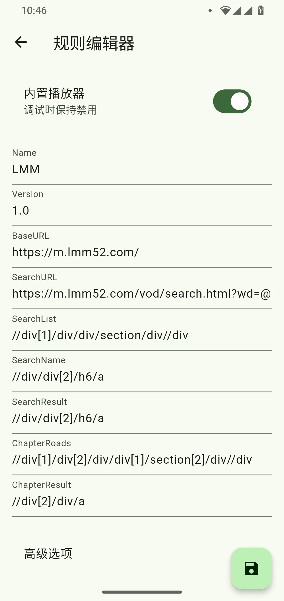

<p align="right"><a href="README.md">简体中文</a> | <strong>English</strong></p>

<div align="center">

<h1>Kazumi</h1>


<a href="https://t.me/kazumi_app"></a>


<a href="https://trendshift.io/repositories/11432"></a>
<a href="https://hellogithub.com/repository/Predidit/Kazumi" target="_blank"></a>

<p>Kazumi is a Flutter app for discovering and streaming anime through custom rules. Build your own rules with up to five lines of XPath selectors, then import and share them. Kazumi also supports real-time upscaling with <code>Anime4K</code>. The project is actively developed.</p>
</div>

## Supported Platforms

- Android 10 and later
- Windows 10 and later
- macOS 10.15 and later
- Linux (experimental)
- iOS 13 and later (requires [sideloading](https://kazumi.app/docs/misc/how-to-install-in-ios))
- HarmonyOS 5.0 and later (available from a [separate repository](https://github.com/ErBWs/Kazumi/releases/latest); requires [sideloading](https://kazumi.app/docs/misc/how-to-install-in-ohos))

## Screenshots

> Screenshots show the current Chinese-language interface.

<table>
  <tr>
    <td></td>
    <td></td>
    <td></td>
  </tr>
  <tr>
    <td></td>
    <td></td>
    <td></td>
  </tr>
</table>

## Features and Development Roadmap

- [x] Rule editor
- [x] Anime catalog
- [x] Anime search
- [x] Anime timetable
- [x] Subtitles
- [x] Episode playback
- [x] Video player
- [x] Multiple video sources
- [x] Rule sharing
- [x] Hardware acceleration
- [x] High refresh rate support
- [x] Watchlist
- [x] Danmaku (bullet comments)
- [x] In-app updates
- [x] Watch history
- [x] Playback speed control
- [x] Color themes
- [x] Cross-device sync
- [x] Wireless casting (DLNA)
- [x] External player support
- [x] Upscaling
- [x] Watch together
- [x] Anime downloads
- [ ] Anime update reminders
- [ ] And more (/・ω・＼)

## Download

Download the latest version from the [Releases](https://github.com/Predidit/Kazumi/releases/latest) page:

<a href="https://github.com/Predidit/Kazumi/releases">
  
</a>

### Android

<a href="https://f-droid.org/packages/com.predidit.kazumi">
  
</a>

### GNU/Linux

<a href="https://flathub.org/apps/io.github.Predidit.Kazumi">
  
</a>

#### Arch Linux

Install from the [AUR](http://aur.archlinux.org).

##### AUR

```bash
[yay/paru] -S kazumi # Build from source
[yay/paru] -S kazumi-bin # Binary package
```

## Contributing

You are welcome to submit your custom rules to our [rules repository](https://github.com/Predidit/KazumiRules). You can choose whether to include your ID in a rule. For a detailed tutorial on writing rules, see the [rule development documentation](https://kazumi.app/docs/rules/develop-rules).

## Q&A

<details>
<summary>User Q&A</summary>

#### Q: Why do some anime have ads?

A: Kazumi does not insert ads. Ads come from video sources. Do not trust their content, and use an ad-free source whenever possible.

#### Q: Why does playback stutter when I enable upscaling?

A: Upscaling requires a capable GPU. If you are not running Kazumi on a high-performance discrete GPU, choose the performance preset instead of the quality preset. Applying upscaling to lower-resolution sources rather than high-resolution sources can also reduce resource usage.

#### Q: Why does playback use so much memory?

A: Kazumi caches as much video as possible during playback to provide a smoother experience. If memory is limited, enable Low Memory Mode in the playback settings to limit caching.

#### Q: Why can't I watch some anime with an external player?

A: Some video sources use anti-hotlinking measures. Kazumi can work around them, but external players cannot.

#### Q: Why does the Linux version lack an icon and tray support?

A: Install the `.deb` package. The `.tar.gz` archive is intended for repackaging and, by design, does not provide icon or tray support.

</details>

<details>
<summary>Rule Author Q&A</summary>

#### Q: Why doesn't my custom rule find any results?

A: XPath support is currently incomplete; Kazumi only supports selectors that start with `//`. Use the example rules as a reference.

#### Q: Why can my custom rule find results but not play them?

A: Try turning off the option to use the built-in player for the custom rule. This makes Kazumi try WebView, which may improve compatibility. When the built-in player works, enabling it is recommended for smoother playback with danmaku.

</details>

<details>
<summary>Developer Q&A</summary>

#### Q: Why can't I build the project?

A: Building the project requires a reliable network connection. In addition to Flutter dependencies hosted by Google, the project also depends on resources hosted by Maven Central, GitHub, and SourceForge. If you are in mainland China, you may need to configure appropriate mirrors.

</details>

## Development

Contributions via pull requests are welcome. Before getting started, read the [contribution guide](static/doc/CONTRIBUTING.md) for the project's pull request and AI-assisted development requirements.

## Artwork

The app icon is artwork by [Yuquanaaa](https://www.pixiv.net/users/66219277), published on [Pixiv](https://www.pixiv.net/artworks/116666979).

The icon is copyrighted by its original creator, [Yuquanaaa](https://www.pixiv.net/users/66219277). Kazumi has permission to use it in this project. It is not free to use; no one may use, copy, modify, or distribute it without the creator's explicit permission.

The embedded font is [Mi Sans](https://hyperos.mi.com/font/zh/details/sc/), developed and owned by [Xiaomi](https://www.mi.com/index.html).

## Disclaimer

This project is licensed under the GNU General Public License version 3 (GPL-3.0). No express or implied warranties are made about its suitability, reliability, or accuracy. To the fullest extent permitted by law, the authors and contributors are not liable for any direct, indirect, incidental, special, or consequential damages arising from use of the software.

Use of this project must comply with applicable local laws and must not infringe third-party intellectual property rights. Data and cache generated by using the project must be deleted within 24 hours. Use beyond 24 hours requires authorization from the relevant rights holders.

## Privacy Policy

Kazumi does not collect user data or use telemetry components.

## Code Signing Policy

Signers: [Contributors](https://github.com/Predidit/Kazumi/graphs/contributors)<br>
Reviewers: [Owners](https://github.com/Predidit)

## Sponsors

| | |
| --- | --- |
|  | Free code signing on Windows provided by [SignPath.io](https://about.signpath.io/), with certificates from the [SignPath Foundation](https://signpath.org/) |
|  | **Automatic pull request reviews provided by [Kilo Code](https://kilo.ai/), sponsored by the [Kilo OSS Program](https://kilo.ai/oss)** |
| <a href="https://m.do.co/c/0062035db3e4"></a> | **Cloud infrastructure is supported by [DigitalOcean](https://m.do.co/c/0062035db3e4)** |

## Acknowledgements

Special thanks to:

- [XpathSelector](https://github.com/simonkimi/xpath_selector), the foundation of this project.
- [dandanplay](https://www.dandanplay.com/), whose open platform provides danmaku integration.
- [Bangumi](https://bangumi.tv/), whose open API provides anime metadata.
- [Anime4K](https://github.com/bloc97/Anime4K), used for real-time upscaling.
- [SyncPlay](https://github.com/Syncplay/syncplay), whose protocol and public servers power watch-together sessions.
- [All contributors](https://github.com/Predidit/Kazumi/graphs/contributors), who make this project better.
- [trace.moe](https://trace.moe), used for anime image recognition.
- [media-kit](https://github.com/media-kit/media-kit), which provides cross-platform media playback.
- [avbuild](https://github.com/wang-bin/avbuild), whose out-of-tree patches enable playback of non-standard streams.
- [hive](https://github.com/isar/hive), used for persistent storage.
