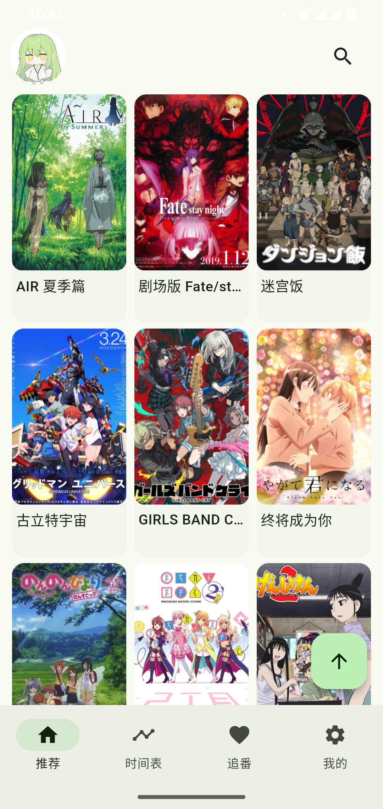
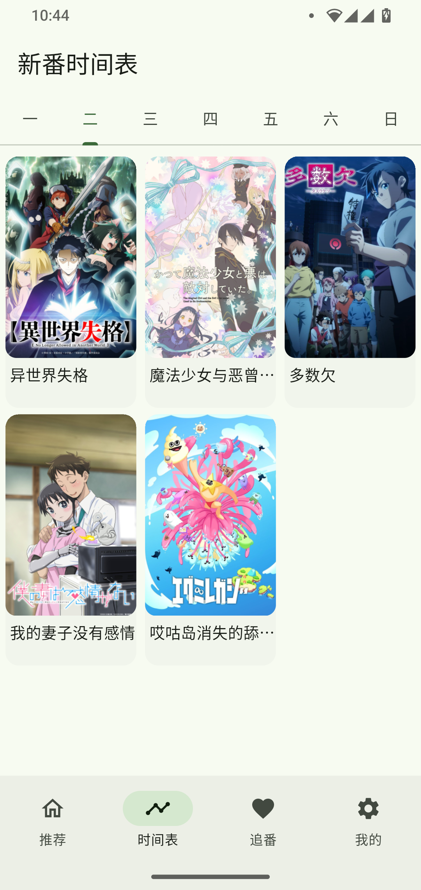
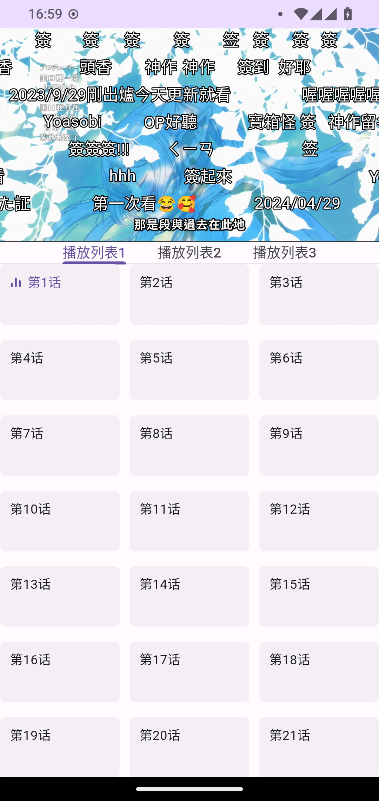
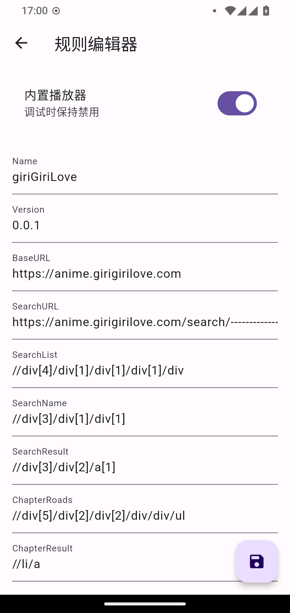
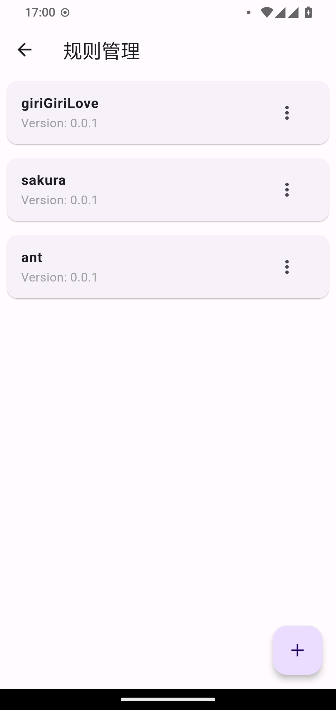
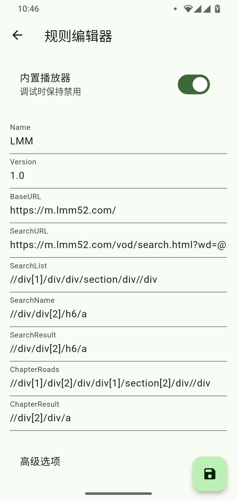

# Akiora

[](https://t.me/kazumi_app)

A Flutter-based anime indexing and online streaming app driven by user-defined rules. Build your own rules with selectors written in `Xpath` syntax (up to five lines). Supports importing and sharing rules, plus real-time super-resolution powered by `Anime4K`. Heavy development in progress (～￣▽￣)～

> Akiora is a renamed/customized build of the upstream [Kazumi](https://github.com/Predidit/Kazumi) project. The package name, F-Droid/Flathub IDs, AUR packages, Telegram group, and release-asset URLs below still point to the upstream Kazumi project where the binaries are actually hosted.

## Supported platforms

- Android 10 and later
- Windows 10 and later
- macOS 10.15 and later
- Linux (experimental)
- iOS 13 and later (requires [self-signing](https://kazumi.app/docs/misc/how-to-install-in-ios.html))
- HarmonyOS 5.0 and later (lives in a [fork repository](https://github.com/ErBWs/Kazumi/releases/latest), requires [sideloading](https://kazumi.app/docs/misc/how-to-install-in-ohos.html))

## Screenshots

<table>
  <tr>
    <td></td>
    <td></td>
    <td></td>
  <tr>
  <tr>
    <td></td>
    <td></td>
    <td></td>
  <tr>
</table>

## Features / Roadmap

- [x] Rule editor
- [x] Anime catalog
- [x] Anime search
- [x] Broadcast schedule
- [x] Anime metadata / details
- [x] Episode playback
- [x] Built-in video player
- [x] Multiple video-source support
- [x] Rule sharing
- [x] Hardware acceleration
- [x] High-refresh-rate support
- [x] Tracking / watchlist
- [x] Danmaku (bullet comments)
- [x] In-app updates
- [x] Watch history
- [x] Variable playback speed
- [x] Color schemes
- [x] Cross-device sync
- [x] Wireless casting (DLNA)
- [x] Playback via external players
- [x] Super-resolution
- [x] Watch Together
- [x] Anime downloads
- [ ] New-episode notifications
- [ ] More to come (/・ω・＼)

## Download

Download from the [releases](https://github.com/Predidit/Kazumi/releases) tab on this page:

<a href="https://github.com/Predidit/Kazumi/releases">
  
</a>

### Android

<a href="https://f-droid.org/packages/com.predidit.kazumi">
  
</a>

### GNU/Linux

<a href="https://flathub.org/apps/io.github.Predidit.Kazumi">
  
</a>

#### Arch Linux

Available from [AUR](http://aur.archlinux.org) or [archlinuxcn](https://github.com/archlinuxcn/repo).

##### AUR

```bash
[yay/paru] -S kazumi      # build from source
[yay/paru] -S kazumi-bin  # binary package
```

##### archlinuxcn

```bash
sudo pacman -S kazumi
```

## Contributing

You are welcome to submit your custom rules to our [rules repository](https://github.com/Predidit/KazumiRules). You may freely choose whether or not to leave your ID in your rule.

## Q&A

<details>
<summary>End-user Q&A</summary>

#### Q: Why are there ads in some anime?

A: This project does not insert any ads. Ads come from the video source. Please do not trust anything in the ads, and prefer video sources without ads when possible.

#### Q: Why does playback stutter when I enable super-resolution?

A: Super-resolution is GPU-intensive. If you are not running Akiora on a high-performance discrete GPU, prefer the performance mode over the quality mode. Using super-resolution on low-resolution video sources rather than high-resolution ones also reduces the performance cost.

#### Q: Why is memory usage high during video playback?

A: During playback the app caches as much of the video into memory as possible to provide a smoother viewing experience. If memory is tight, you can enable Low Memory Mode in the playback settings tab to limit the cache.

#### Q: Why can a few anime not be played in an external player?

A: Some video sources use anti-hotlinking measures. Akiora can work around them, but external players cannot.

#### Q: Why is the Linux build I downloaded missing icons and tray support?

A: Install using the `.deb` package; the `.tar.gz` is only intended to make repackaging easier and inherently lacks icon and tray support.

</details>

<details>
<summary>Rule-author Q&A</summary>

#### Q: Why does my custom rule fail to perform searches?

A: Our `Xpath` support is currently incomplete; only selectors starting with `//` are supported. We recommend using the example rules we provide as a template for your own.

#### Q: My custom rule can search but cannot play. Why?

A: Try disabling "Use built-in player" on the custom rule; this falls back to `webview` for playback and improves compatibility. When the built-in player works, however, prefer it for smoother playback and danmaku support.

</details>

<details>
<summary>Developer Q&A</summary>

#### Q: I'm trying to build the project myself but the build fails.

A: Building requires a healthy network. In addition to the Flutter-related dependencies hosted by Google, this project depends on resources hosted on MavenCentral / GitHub / SourceForge. If you are in mainland China you may need to configure appropriate mirrors.

</details>

## Art assets

The app icon used by upstream Kazumi was created by [Yuquanaaa](https://www.pixiv.net/users/66219277) and published on [Pixiv](https://www.pixiv.net/artworks/116666979). Copyright is held by the original author [Yuquanaaa](https://www.pixiv.net/users/66219277), and upstream has obtained their authorization to use it. The icon is **not** freely usable; without explicit permission from the original author no one may use, copy, modify, or distribute it.

This Akiora fork ships its own custom icon and does not redistribute the upstream icon. Any custom artwork bundled here belongs to its respective owner.

The bundled font is [Mi Sans](https://hyperos.mi.com/font/en/details/sc/), developed and copyrighted by [Xiaomi](https://www.mi.com/).

## Disclaimer

This project is licensed under the GNU General Public License v3.0 (GPL-3.0). We make no express or implied warranty as to its fitness, reliability, or accuracy. To the maximum extent permitted by law, the authors and contributors are not liable for any direct, indirect, incidental, special, or consequential damages arising from the use of this software.

Use of this project must comply with the laws and regulations of your jurisdiction, and must not infringe any third party's intellectual property rights. Any data and caches generated by using this project should be cleared within 24 hours; use beyond 24 hours requires authorization from the relevant rights holder.

## Privacy policy

We do not collect any user data and do not use any telemetry components.

## Code signing policy
Submitters: [Contributors](https://github.com/Predidit/Kazumi/graphs/contributors)
Reviewers: [Owner](https://github.com/Predidit)

## Sponsors
|  | Free code signing on Windows provided by [SignPath.io](https://about.signpath.io/), certificate by [SignPath Foundation](https://signpath.org/) |
|------------------------------------------------------------|--------------------------------------------------------------------------------------------------------------------------------------------------|

## Acknowledgments

Special thanks to [XpathSelector](https://github.com/simonkimi/xpath_selector) — this excellent project is the cornerstone of ours.

Special thanks to [DandanPlayer](https://www.dandanplay.com/) — we use the dandanplay open API to power danmaku interactions.

Special thanks to [Bangumi](https://bangumi.tv/) — we use the Bangumi open API for anime metadata.

Special thanks to [Anime4K](https://github.com/bloc97/Anime4K) — used for real-time super-resolution.

Special thanks to [SyncPlay](https://github.com/Syncplay/syncplay) — we use the SyncPlay protocol and its public servers to power Watch Together.

Special thanks to [trace.moe](https://trace.moe) — used for the image-based anime search feature.

Thanks to [media-kit](https://github.com/media-kit/media-kit) — provides cross-platform media playback.

Thanks to [avbuild](https://github.com/wang-bin/avbuild) — we use out-of-tree patches from avbuild to enable non-standard video-stream playback.

Thanks to [hive](https://github.com/isar/hive) — provides the persistent storage layer.
