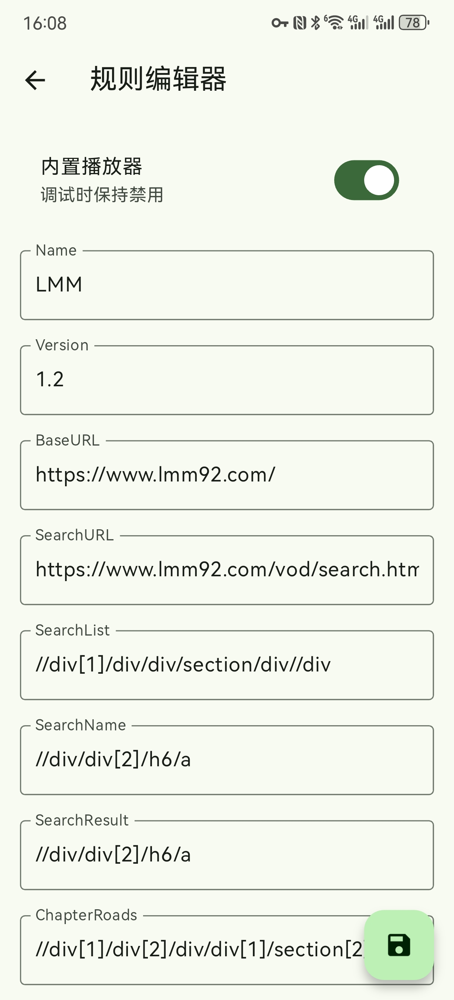

# Kazumi
使用 flutter 开发的基于自定义规则的番剧采集与在线观看程序。使用最多五行基于 `Xpath` 语法的选择器构建自己的规则。支持规则导入与规则分享。绝赞开发中 (～￣▽￣)～

## 支持平台

- Android 10 及以上
- Windows 10 及以上
- iOS (需要自构建)

## 屏幕截图 

<table>
  <tr>
    <td></td>
    <td></td>
    <td></td>
  <tr>
  <tr>
    <td></td>
    <td></td>
    <td></td>
  <tr>
</table>

## 功能 / 开发计划

- [x] 规则编辑器
- [x] 番剧目录
- [x] 番剧搜索
- [x] 番剧时间表
- [x] 番剧字幕
- [x] 分集播放
- [x] 视频播放器
- [x] 多视频源支持
- [x] 规则分享
- [x] 硬件加速
- [x] 高刷适配
- [x] 追番列表
- [x] 番剧弹幕
- [x] 在线更新
- [x] 历史记录
- [x] 倍速播放
- [x] 配色方案 
- [x] 跨设备同步
- [ ] 番剧下载
- [ ] 番剧更新提醒
- [ ] 还有更多 (/・ω・＼) 

## 下载

通过本页面 [release](https://github.com/Predidit/Kazumi/releases) 选项卡下载

## 贡献

欢迎向我们的 [规则仓库](https://github.com/Predidit/KazumiRules) 提交您的自定义规则。您可以自由选择是否在规则中留下您的ID

## Q&A

#### Q: 为什么我的自定义规则无法实现检索。

A: 目前我们对 `Xpath` 语法的支持并不完整, 我们目前只支持以 `//` 开头的选择器。建议参照我们给出的示例规则构建自定义规则。

#### Q: 为什么我的自定义规则可以实现检索，但不能实现观看。

A: 尝试关闭自定义规则的使用内置播放器功能, 这将会使用 `webview` 进行播放, 大大提高兼容性。但在内置播放器可用时, 建议启用内置播放器, 以获得更加流畅并带有弹幕的观看体验。

#### Q: 我在尝试自行编译该项目，但编译没有成功。

A: 本项目编译需要良好的网络环境，如果您位于中国大陆，可能需要设置恰当的镜像地址。

#### Q: 为什么少数番剧中有广告。

A: 本项目未插入任何广告。广告来自视频源，请不要相信广告中的任何内容，并尽量选择没有广告的视频源观看。

## 免责声明

本项目基于 GNU 通用公共许可证第3版（GPL-3.0）授权。我们不对其适用性、可靠性或准确性作出任何明示或暗示的保证。在法律允许的最大范围内，作者和贡献者不承担任何因使用本软件而产生的直接、间接、偶然、特殊或后果性的损害赔偿责任。

使用本项目需遵守所在地法律法规，不得进行任何侵犯第三方知识产权的行为。因使用本项目而产生的数据和缓存应在24小时内清除，超出24小时的使用需获得相关权利人的授权。

## 禁止商用条款

本软件仅供个人学习、研究或非商业用途。禁止将本软件用于任何商业目的，包括但不限于出售、出租、许可或以其他形式从中获利。

## 致谢

特别感谢 [XpathSelector](https://github.com/simonkimi/xpath_selector) 这个优秀的项目是本项目的基石。

特别感谢 [DandanPlayer](https://www.dandanplay.com/) 本项目使用了 dandanplayer 开放API 以提供弹幕交互。

特别感谢 [Bangumi](https://bangumi.tv/) 本项目使用了 Bangumi 开放API 以提供番剧元数据。

感谢 [media_kit](https://github.com/media-kit/media-kit) 本项目跨平台媒体播放能力来自 media_kit

感谢 [hive](https://github.com/isar/hive) 本项目持久化储存能力来自 hive

