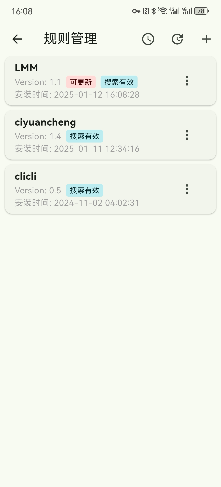

# Kazumi
使用 Flutter 开发的基于自定义规则的番剧采集与在线观看程序。使用最多五行基于 `Xpath` 语法的选择器构建自己的规则。支持规则导入与规则分享。支持基于 `Anime4K` 的实时超分辨率。绝赞开发中 (～￣▽￣)～

## 支持平台

- Android 10 及以上
- Windows 10 及以上
- MacOS 10.15 及以上
- Linux (实验性)
- iOS 13 及以上 (需要[自签名](https://kazumi.app/docs/misc/how-to-install-in-ios.html))
- HarmonyOS 5.0 及以上 (位于[分支仓库](https://github.com/ErBWs/Kazumi/releases/latest)，需要[侧载](https://kazumi.app/docs/misc/how-to-install-in-ohos.html))

## 屏幕截图 

<table>
  <tr>
    <td></td>
    <td></td>
    <td></td>
  <tr>
  <tr>
    <td></td>
    <td></td>
    <td></td>
  <tr>
</table>

## 功能 / 开发计划

- [x] 规则编辑器
- [x] 番剧目录
- [x] 番剧搜索
- [x] 番剧时间表
- [x] 番剧字幕
- [x] 分集播放
- [x] 视频播放器
- [x] 多视频源支持
- [x] 规则分享
- [x] 硬件加速
- [x] 高刷适配
- [x] 追番列表
- [x] 番剧弹幕
- [x] 在线更新
- [x] 历史记录
- [x] 倍速播放
- [x] 配色方案 
- [x] 跨设备同步
- [x] 无线投屏 (DLNA)
- [x] 外部播放器播放
- [x] 超分辨率
- [x] 一起看
- [ ] 番剧下载
- [ ] 番剧更新提醒
- [ ] 还有更多 (/・ω・＼) 

## 下载

通过本页面 [releases](https://github.com/Predidit/Kazumi/releases) 选项卡下载：

<a href="https://github.com/Predidit/Kazumi/releases">
  
</a>

### Android

<a href="https://f-droid.org/packages/com.predidit.kazumi">
  
</a>

### GNU/Linux

&nbsp;&nbsp;
<a href="https://flathub.org/apps/io.github.Predidit.Kazumi">
  
</a>

#### Arch Linux

可以从 [AUR](http://aur.archlinux.org) 或 [archlinuxcn](https://github.com/archlinuxcn/repo) 安装。

##### AUR

```bash
[yay/paru] -S kazumi # 从源码构建
[yay/paru] -S kazumi-bin # 二进制包
```

##### archlinuxcn

```bash
sudo pacman -S kazumi
```

## 贡献

欢迎向我们的 [规则仓库](https://github.com/Predidit/KazumiRules) 提交您的自定义规则。您可以自由选择是否在规则中留下您的ID

## Q&A

<details>
<summary>使用者 Q&A</summary>

#### Q: 为什么少数番剧中有广告？

A: 本项目未插入任何广告。广告来自视频源, 请不要相信广告中的任何内容, 并尽量选择没有广告的视频源观看。

#### Q: 为什么我启用超分辨率功能后播放卡顿？

A: 超分辨率功能对 GPU 性能要求较高, 如果没有在高性能独立显卡上运行 Kazumi, 尽量选择效率档而非质量档。对低分辨率视频源而非高分辨率视频源使用超分也可以降低性能消耗。

#### Q: 为什么播放视频时内存占用较高？

A: 本程序在视频播放时, 会尽可能多地缓存视频到内存, 以提供较好的观看体验。如果您的内存较为紧张, 可以在播放设置选项卡启用低内存模式, 这将限制缓存。

#### Q: 为什么少数番剧无法通过外部播放器观看？

A: 部分视频源的番剧使用了反盗链措施, 这可以被 Kazumi 解决, 但无法被外部播放器解决。

#### Q: 为什么下载的 Linux 版本缺少图标和托盘功能？

A: 使用 .deb 版本进行安装, tar.gz 版本仅为方便二次打包, 这一格式先天缺乏图标和托盘功能支持。

</details>

<details>
<summary>规则编写者 Q&A</summary>

#### Q: 为什么我的自定义规则无法实现检索？

A: 目前我们对 `Xpath` 语法的支持并不完整, 我们目前只支持以 `//` 开头的选择器。建议参照我们给出的示例规则构建自定义规则。

#### Q: 为什么我的自定义规则可以实现检索, 但不能实现观看？

A: 尝试关闭自定义规则的使用内置播放器选项, 这将尝试使用 `webview` 进行播放, 提高兼容性。但在内置播放器可用时, 建议启用内置播放器, 以获得更加流畅并带有弹幕的观看体验。

</details>

<details>
<summary>开发者 Q&A</summary>

#### Q: 我在尝试自行编译该项目, 但编译没有成功。

A: 本项目编译需要良好的网络环境, 除了由 Google 托管的 Flutter 相关依赖外, 本项目同样依赖托管在 MavenCentral/Github/SourceForge 上的资源。如果您位于中国大陆, 可能需要设置恰当的镜像地址。

</details>

## 美术资源

本项目图标来自 [Yuquanaaa](https://www.pixiv.net/users/66219277) 发表在 [Pixiv](https://www.pixiv.net/artworks/116666979) 上的作品。

此图标由其原作者 [Yuquanaaa](https://www.pixiv.net/users/66219277) 拥有版权。我们已获得原作者的授权和许可, 可以在本项目中使用这一图标。这一图标不是自由使用的, 未经原作者明确授权, 任何人不得擅自使用、复制、修改或分发这一图标。

本项目内嵌字体为 [Mi Sans](https://hyperos.mi.com/font/en/details/sc/) 字体, 由 [Xiaomi](https://www.mi.com/) 开发和拥有版权。

## 免责声明

本项目基于 GNU 通用公共许可证第 3 版（GPL-3.0）授权。我们不对其适用性、可靠性或准确性作出任何明示或暗示的保证。在法律允许的最大范围内, 作者和贡献者不承担任何因使用本软件而产生的直接、间接、偶然、特殊或后果性的损害赔偿责任。

使用本项目需遵守所在地法律法规, 不得进行任何侵犯第三方知识产权的行为。因使用本项目而产生的数据和缓存应在24小时内清除, 超出 24 小时的使用需获得相关权利人的授权。

## 隐私政策 (Privacy policy)

我们不收集任何用户数据, 不使用任何遥测组件。

## 代码签名策略 (Code signing policy)
提交者: [Contributors](https://github.com/Predidit/Kazumi/graphs/contributors)
审阅者: [Owner](https://github.com/Predidit)

## 赞助 (Sponsors)
|  | Free code signing on Windows provided by [SignPath.io](https://about.signpath.io/), certficate by [SignPath Foundation](https://signpath.org/) |
|------------------------------------------------------------|-----------------------------------------------------------------------------------------------------------------------------------------------|

## 致谢

特别感谢 [XpathSelector](https://github.com/simonkimi/xpath_selector) 这个优秀的项目是本项目的基石。

特别感谢 [DandanPlayer](https://www.dandanplay.com/) 本项目使用了 dandanplayer 开放 API 以提供弹幕交互。

特别感谢 [Bangumi](https://bangumi.tv/) 本项目使用了 Bangumi 开放 API 以提供番剧元数据。

特别感谢 [Anime4K](https://github.com/bloc97/Anime4K) 本项目使用 Anime4K 进行实时超分。

特别感谢 [SyncPlay](https://github.com/Syncplay/syncplay) 本项目使用 SyncPlay 协议并通过 SyncPlay 公共服务器实现一起看功能。

感谢 [media-kit](https://github.com/media-kit/media-kit) 本项目跨平台媒体播放能力来自 media-kit。

感谢 [avbuild](https://github.com/wang-bin/avbuild) 本项目使用了来自 avbuild 的树外补丁实现非标准视频流播放。

感谢 [hive](https://github.com/isar/hive) 本项目持久化储存能力来自 hive。


