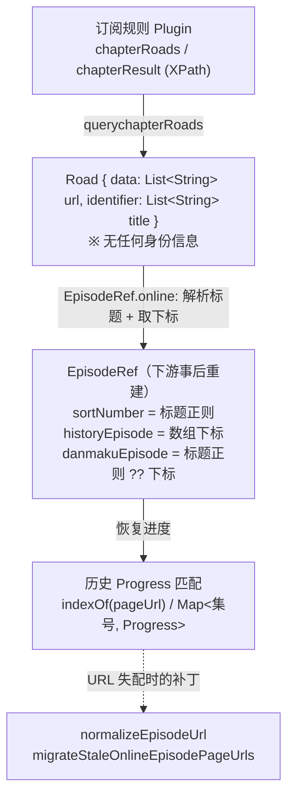
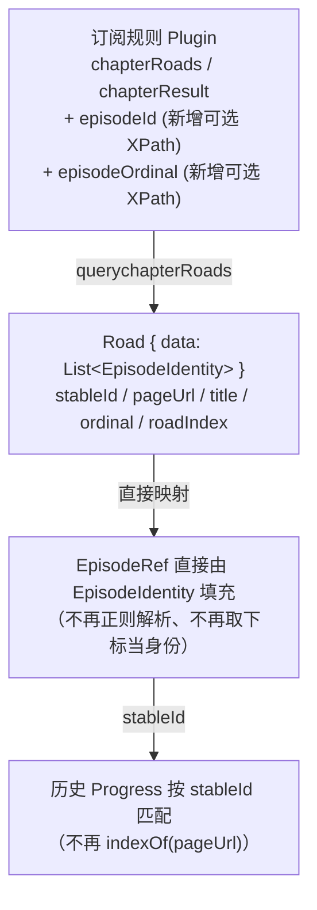
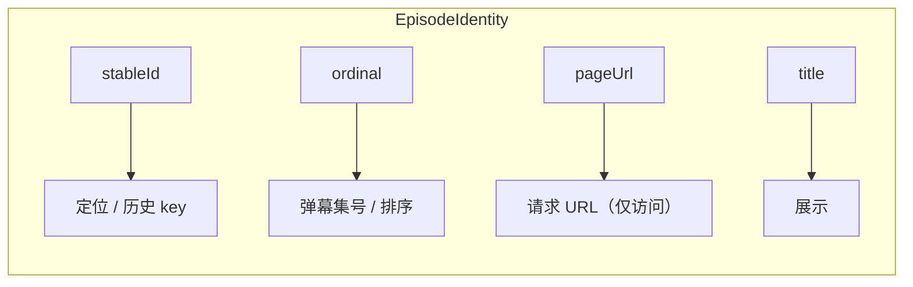

# 让订阅规则直接产出 Episode 身份（设计草案）

> 目标：不再让播放器从 URL 反推 episode 身份，而是让**订阅规则（`Plugin`）在抓取阶段就产出稳定的 episode 身份**，下游（历史、弹幕、选集、下载）直接消费，不再做"标题正则 + 数组下标 + URL 字符串反查"的事后重建。

本文档分四部分：

1. 现状链路与痛点
2. 目标数据结构（图 + 定义）
3. 字段 ↔ 边界条件映射表
4. 迁移与兼容

---

## 1. 现状链路与痛点

订阅规则只产出两条平行数组（URL 列表 + 标题列表），身份由下游"猜"出来：



核心痛点：

- **身份非规则给定**：用 `extractEpisodeNumber`（标题正则）+ 数组下标拼凑，标题不规范（"OVA"/"特别篇"）即退化为下标。
- **回填依赖 URL 字符串相等**：`roadList[i].data.indexOf(pageUrl)`，源站换域名 / URL 带随机参数 / 列表换序就失配，只能靠 `normalizeEpisodeUrl` + `migrateStaleOnlineEpisodePageUrls` 硬撑。

相关现状代码：`lib/plugins/plugins.dart`、`lib/modules/roads/road_module.dart`、`lib/pages/video/video_controller.dart`（`EpisodeRef` / `findEpisodeSelectionByPageUrl`）、`lib/utils/media.dart`（`extractEpisodeNumber`）、`lib/repositories/history_repository.dart`。

---

## 2. 目标数据结构

### 2.1 核心思想：身份分两个面

| 面 | 用途 | 谁能产出 | 稳定性来源 |
| --- | --- | --- | --- |
| **定位/持久 key**（`stableId`） | 历史进度、选集、跨重抓/重启匹配 | 规则可直接产出 | 源站为该集暴露的稳定标识（slug / id / 相对 path） |
| **序数**（`ordinal`） | 弹幕集号、排序、显示 | 规则产出，但需对齐外部编号 | 对齐 Bangumi 1..N 官方编号 |

把两者合成一个值是当前 bug 的根源，目标结构显式拆开。

### 2.2 目标类型

`Road.data` 从 `List<String>` 升级为 `List<EpisodeIdentity>`：

```dart
/// 订阅规则在抓取阶段直接产出的单集身份。
/// 一旦产出即为权威，下游不得再从 URL/标题反推。
class EpisodeIdentity {
  /// 定位/持久 key：在 (规则, 番剧, road 作用域) 内唯一且顺序无关。
  /// 优先级：源站显式 id/slug > 归一化相对 path；URL 噪声/域名不参与。
  /// 用作历史进度匹配主键。
  final String stableId;

  /// 可访问的请求 URL（归一化后）。仅用于发起请求，不再用于身份匹配。
  final String pageUrl;

  /// 展示标题（原样，保留 "OVA"/"特别篇" 等）。
  final String title;

  /// 集序数：对齐 Bangumi 官方 1..N 的弹幕/排序号；
  /// 源站无法判定时为 null（下游可显式降级为列表位次，但不写回 stableId）。
  final int? ordinal;

  /// 该集所属的原始线路下标（规则抓取时的 road 次序，顺序无关）。
  final int roadIndex;

  const EpisodeIdentity({
    required this.stableId,
    required this.pageUrl,
    required this.title,
    required this.roadIndex,
    this.ordinal,
  });
}
```

```dart
class Road {
  String name;
  List<EpisodeIdentity> data; // 由 List<String> 升级而来
  // identifier 取消：title 已并入 EpisodeIdentity

  Road({required this.name, required this.data});
}
```

### 2.3 目标链路





### 2.4 规则字段（`Plugin`）新增

| 字段 | 类型 | 说明 | 缺省行为 |
| --- | --- | --- | --- |
| `episodeId` | String(XPath) | 抽取源站稳定标识（如 `@data-id`、slug） | 空 → 回退用归一化相对 path 作为 `stableId` |
| `episodeOrdinal` | String(XPath) | 抽取可对齐 Bangumi 的集序号 | 空 → 尝试标题解析；再失败 → `ordinal = null` |

> 规则向后兼容：旧规则无新字段时，`stableId = 归一化相对 path`、`ordinal = 标题解析 ?? null`，行为不劣于现状。

---

## 3. 字段 ↔ 边界条件映射

每个字段对应上一轮讨论的具体边界条件，以及降级策略：

| 字段 | 抵御的边界条件 | 不变性要求 | 降级策略 |
| --- | --- | --- | --- |
| `stableId` | 域名/协议变更、尾斜杠、query 噪声、列表升降序、增删换序、重抓、重启 | 顺序无关；域名/协议无关；作用域内唯一 | 源站无 id → 用归一化**相对 path**（剥离 baseURL，避免域名迁移失配） |
| `pageUrl` | session token / 时间戳 query | 仅需"可访问"，不需稳定 | 由 `normalizeEpisodeUrl` 归一化；不参与匹配，故噪声不致命 |
| `ordinal` | 标题非数字（OVA/特别篇/预告）、多 part（13 上/下）、重号 | 对齐 Bangumi 1..N | 无法判定 → `null`；下游显示用列表位次，但**不写回 stableId** |
| `title` | —（仅展示） | 原样保留 | 空 → `第N集` 占位 |
| `roadIndex` | 线路重排 | 标识原始线路，顺序无关 | 缺失 → 取抓取次序 |
| 作用域键 `(pluginName, bangumiId, entryKind)` | 换规则/换番剧/online↔offline 串档 | 跨命名空间隔离 | 维持现有 `History.scopedKey` |

未被单一字段覆盖、需在策略层处理的边界：

- **online ↔ offline 一致性**：离线身份当前用下载记录 `episodeNumber`。迁移后离线侧 `stableId` 应复用下载记录里持久化的源站 `stableId`（需在下载时一并落库），从而与在线侧同键互通。
- **源站完全无稳定信号**（仅位置性 `<a href>` 且 URL 全易变）：这是物理下限——此时 `stableId` 只能退回"归一化相对 path"，若连 path 都易变，则身份不可能稳定，应明确接受"该源不支持跨域名迁移的进度续看"。

---

## 4. 迁移与兼容

1. **数据结构**：`Road.data: List<String> → List<EpisodeIdentity>`，移除 `Road.identifier`（并入 `title`）。改动点集中在 `lib/modules/roads/road_module.dart`、`lib/plugins/plugins.dart`（`querychapterRoads`）、`lib/pages/video/video_controller.dart`（`_resolveOnlineEpisode` / `EpisodeRef`）。
2. **历史匹配主键切换**：`Progress` 新增 `stableId` 字段（Hive `@HiveField`，`defaultValue: ''`）。匹配优先级：`stableId` > 旧 `episodePageUrl`（兼容存量） > 集号。`findEpisodeSelectionByPageUrl` 改为 `findEpisodeSelectionByStableId`。
3. **存量历史**：保留 `episodePageUrl` 字段与 `migrateStaleOnlineEpisodePageUrls` 一个版本周期，作为无 `stableId` 老数据的回退；新写入同时填 `stableId`，逐步收敛后再下线 URL 反查补丁。
4. **规则向后兼容**：见 2.4，旧规则不变可用，行为不劣于现状。
5. **测试**：扩展 `test/episode_ref_test.dart`，新增 `stableId` 在"换域名 / 列表换序 / 标题非数字"下仍命中同一历史桶的用例。

---

### 附：相关源码索引

- 规则与抓取：`lib/plugins/plugins.dart`
- 线路模型：`lib/modules/roads/road_module.dart`
- 身份重建与 URL 反查：`lib/pages/video/video_controller.dart`
- URL 归一化：`lib/utils/episode_url.dart`
- 标题解析：`lib/utils/media.dart`
- 历史身份与匹配：`lib/modules/history/history_module.dart`、`lib/repositories/history_repository.dart`
