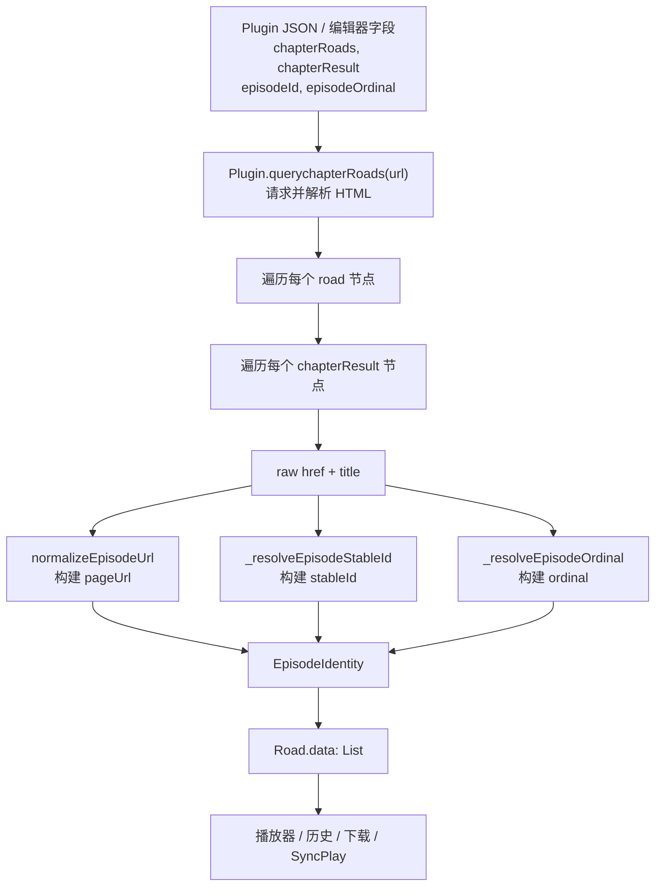

# stableId 解析与构建设计

> 本文描述当前实现中的 `EpisodeIdentity.stableId` 如何从订阅规则和集数 URL 中解析、构建、存储与消费。它不是早期草案；对应代码主要在 `lib/plugins/plugins.dart`、`lib/utils/episode_url.dart`、`lib/modules/roads/road_module.dart`、`lib/pages/video/video_controller.dart`、`lib/repositories/history_repository.dart` 和 `lib/modules/download/download_module.dart`。

## 1. 核心定义

`stableId` 是单集的稳定定位 key。它的职责是回答“这是不是同一集”，用于历史进度、选集恢复、下载查重、离线/在线身份互通和 SyncPlay 集数切换。

它不承担以下职责：

- 不作为请求 URL：请求 URL 是 `EpisodeIdentity.pageUrl`。
- 不作为显示标题：显示标题是 `EpisodeIdentity.title`。
- 不作为弹幕/排序集号：集序数是 `EpisodeIdentity.ordinal`。
- 不保证全局唯一：它在同一规则、同一番剧、线路上下文内使用；多线路出现相同 `stableId` 时，下游用保存的 road 优先消歧。

最终单集身份由 `EpisodeIdentity` 承载：

```dart
class EpisodeIdentity {
  final String stableId; // 持久定位 key
  final String pageUrl;  // 归一化后的可访问 URL
  final String title;    // 展示标题
  final int? ordinal;    // 集序数
  final int roadIndex;   // 规则抓取时的线路下标
}
```

## 2. 总体链路



关键点：`stableId` 在插件抓取集数列表时一次性构建。播放器不再从标题、数组下标或 URL 字符串反推 episode 身份。

## 3. 输入字段

`Plugin` 新增两个可选字段，并通过 `fromJson` / `toJson` 持久化，也在插件编辑器里可配置：

| 字段 | 含义 | XPath 作用域 | 为空时 |
| --- | --- | --- | --- |
| `episodeId` | 源站暴露的单集稳定标识，如 `data-id`、slug、业务 id | 相对每个 `chapterResult` 节点 | 回退到 URL 派生的稳定相对路径 |
| `episodeOrdinal` | 可对齐 Bangumi/弹幕的集序数 | 相对每个 `chapterResult` 节点 | 从标题解析；仍失败则为 `null` |

`chapterRoads` 先选出线路节点，`chapterResult` 再在线路节点内部选出单集节点。`episodeId` 和 `episodeOrdinal` 都是相对单集节点解析，不是从整个文档根节点解析。

## 4. 单集解析过程

`Plugin.querychapterRoads` 对每个 `chapterResult` 节点执行以下步骤：

1. 从节点属性读取 `href`：

```dart
final String rawUrl = item.node.attributes['href'] ?? '';
```

2. 从节点文本读取标题，并移除所有空白：

```dart
final String itemName =
    (item.node.text ?? '').replaceAll(RegExp(r'\s+'), '');
```

3. 构建归一化请求 URL：

```dart
final String normalizedUrl = normalizeEpisodeUrl(baseUrl, rawUrl);
```

4. 构建 `EpisodeIdentity`：

```dart
EpisodeIdentity(
  stableId: _resolveEpisodeStableId(item, baseUrl, normalizedUrl),
  pageUrl: normalizedUrl,
  title: itemName,
  ordinal: _resolveEpisodeOrdinal(item, itemName),
  roadIndex: roadIndex,
)
```

如果某条线路解析出的 `episodes` 非空，就写入 `Road(name: '播放线路$count', data: episodes)`。

## 5. XPath 值抽取规则

`episodeId` 和 `episodeOrdinal` 都通过 `_extractNodeValue(item, xpath)` 抽取：

1. 执行 `item.queryXPath(xpath).node`。
2. 如果节点文本 `node.text.trim()` 非空，优先返回文本。
3. 如果文本为空且节点有属性，返回第一个属性值。
4. 解析异常、未命中、空文本、空属性都返回空字符串。

这允许规则写成“指向文本节点”或“指向带属性的节点”。例如：

| 目标 | 可能的 XPath | 抽取结果 |
| --- | --- | --- |
| `<a data-id="ep-12">第12话</a>` | `.` | 文本 `第12话`，不适合作为 `episodeId` |
| `<a data-id="ep-12">第12话</a>` | `./@data-id` 或能选中该属性的表达式 | `ep-12` |
| `<span data-sort="12"></span>` | `./span/@data-sort` | `12` |

规则作者应确保 `episodeId` 选择器命中的是稳定值，而不是展示文案、session token、临时时间戳或会随镜像变化的完整域名。

## 6. pageUrl 归一化

`pageUrl` 由 `normalizeEpisodeUrl(baseUrl, raw)` 构建，作为“可访问 URL”，不再作为主身份 key。

归一化规则：

- 去除首尾空白；空输入返回空字符串。
- 相对路径基于 `baseUrl` 解析成绝对 URL。
- 已经是绝对 URL 时直接使用该 URL。
- `http` 统一为 `https`。
- 去除 path 末尾多余 `/`，但保留根路径 `/`。
- 保留非空 query 和 fragment。
- 去除空 query。
- 如果无法解析为绝对 URL，返回去空白后的原始输入。
- 函数设计为幂等：再次归一化不会改变结果。

示例：

| `baseUrl` | `raw` | `pageUrl` |
| --- | --- | --- |
| `https://www.example.com` | `/play/123/` | `https://www.example.com/play/123` |
| `http://www.example.com` | `/play/123.html` | `https://www.example.com/play/123.html` |
| `https://www.example.com` | `//cdn.example.com/play/123` | `https://cdn.example.com/play/123` |
| `https://www.example.com` | `/play?id=123&ep=4` | `https://www.example.com/play?id=123&ep=4` |
| 空字符串 | `/play/123.html` | `/play/123.html` |

## 7. stableId 构建算法

`stableId` 由 `_resolveEpisodeStableId(item, baseUrl, normalizedUrl)` 计算：

```dart
if (episodeId.isNotEmpty) {
  final explicit = _extractNodeValue(item, episodeId);
  if (explicit.isNotEmpty) {
    return explicit;
  }
}
return stableEpisodeIdFromUrl(baseUrl, normalizedUrl);
```

优先级只有两层：

1. 显式 `episodeId` XPath 抽取值。
2. URL 派生的稳定相对身份。

显式 `episodeId` 命中后不会再被 URL 归一化、hash 或裁剪；只使用 `_extractNodeValue` 返回的 trim 后字符串。因此显式 id 的稳定性完全由规则保证。

### 7.1 URL fallback

当没有配置 `episodeId` 或 XPath 未命中时，使用 `stableEpisodeIdFromUrl(baseUrl, normalizedUrl)`：

1. 先调用 `normalizeEpisodeUrl`，保证协议、尾斜杠、相对路径口径一致。
2. 如果结果为空，返回空字符串。
3. 如果能解析成带 host 的绝对 URL，剥离 `scheme://host[:port]`，只保留：

```text
path + ?query + #fragment
```

4. 如果无法解析成绝对 URL，则返回归一化结果本身。

示例：

| `episodeId` 配置/结果 | `baseUrl` | `rawUrl` / `normalizedUrl` | `stableId` |
| --- | --- | --- | --- |
| 未配置 | `https://old.example.com` | `https://old.example.com/play/1/` | `/play/1` |
| 未配置 | `https://new.example.org` | `http://new.example.org/play/1` | `/play/1` |
| 未配置 | `https://www.example.com` | `/play?id=123&ep=4` | `/play?id=123&ep=4` |
| XPath 命中 `ep-123` | 任意 | 任意 | `ep-123` |
| XPath 未命中 | `''` | `/play/123.html` | `/play/123.html` |

注意：fallback 会剥离域名，但不会删除有意义的 query。如果源站把 session、token、时间戳放在 query 中，而 path 本身不足以稳定定位单集，应配置 `episodeId` 指向真正稳定的业务 id。

## 8. ordinal 构建

`ordinal` 与 `stableId` 分离。它只用于弹幕集号、排序和下载集号，不参与身份匹配。

`_resolveEpisodeOrdinal(item, title)` 的优先级：

1. 如果配置了 `episodeOrdinal`，先用 `_extractNodeValue` 抽取。
2. 对抽取值调用 `extractEpisodeNumber`；解析为正整数才采用。
3. 如果未配置或解析失败，再对标题调用 `extractEpisodeNumber`。
4. 标题也无法解析时返回 `null`。

播放期会通过 `episodeSortNumberForPlayback` 得到最终排序/弹幕口径：

```dart
return ruleOrdinal ?? anchoredSortNumber ?? listIndex;
```

也就是说规则给出的 `ordinal` 优先，其次使用 Bangumi 列表锚定的 sort，最后才退回播放列表位次。

## 9. 下游消费方式

### 9.1 选集与恢复

`Road.indexOfStableId` 在单条线路中精确匹配 `EpisodeIdentity.stableId`。

`findEpisodeSelectionByStableId` 会：

1. trim 输入；空字符串直接返回 `null`。
2. 如果传入 `preferredRoad`，先在该线路查找。
3. 未命中再遍历其他线路。
4. 返回 `(episode: index + 1, road: roadIndex)`。

`findEpisodeSelectionForHistoryProgress` 用于历史恢复。只要历史里有非空 `stableId`，就必须通过 `stableId` 命中；如果 stableId 未命中，不再按 `(road, episode)` 下标兜底，避免列表重排后误跳到错误集。只有 `stableId` 为空的旧历史才允许走下标兼容。

### 9.2 历史进度

`History` 和 `Progress` 都持久化 `stableId`：

- `History.stableId`：上次观看单集的顶层身份。
- `Progress.stableId`：单个进度桶的身份。

历史写入通过 `PlaybackHistoryIdentity` 传入当前 `stableId`。`HistoryRepository.updateHistory` 先用 `_HistoryEpisodeMatcher.find` 找既有进度桶：

1. 优先按 `stableId` 匹配。
2. 其次按 `episodePageUrl` 匹配旧数据；如果请求带 stableId，则只允许命中 stableId 为空或相同的旧进度。
3. 最后在没有 stableId 和 pageUrl 的情况下按集号回退。

重要保护：如果调用方提供了非空 `stableId`，但 stableId 未命中且没有可用 pageUrl 兼容命中，匹配器返回 `null`，不会按集号误绑。

存量迁移有两条路径：

- `_backfillProgressIdentity`：当旧进度通过 pageUrl 或集号被命中时，补写缺失的 `episodePageUrl` / `stableId`。
- `migrateStaleOnlineEpisodeIdentity`：在线视频页打开后，根据当前 `roadList` 的 `(road, episode)` 解析当前 `pageUrl` 和 `stableId`，调用 `migrateProgressPageUrls` 就地更新旧历史。URL 冲突时保留 `updatedAtMs` 较新的进度桶。

### 9.3 下载

下载侧把 `stableId` 作为新记录的查重主键之一：

- `startDownload` 接收 `stableId`。
- 非空时先查找 `(stableId, road)` 是否已有下载记录。
- 如果旧记录没有 stableId，但同 road、同 pageUrl 命中，则补写 stableId 并跳过重复下载。
- 如果 stableId 为空，则只能按旧的 `(pageUrl, road)` 兼容查重。

`DownloadRecord.episodes` 的 Hive map key 不再直接等于集序数。`downloadKeyForEpisodeIdentity` 的规则：

- stableId 为空：key 仍为 `episodeNumber`。
- stableId 非空：对 `"$road\n$stableId"` 计算 FNV-1a 风格 hash，得到稳定本地 key。
- 如果 hash 冲突，向后递增，直到空位或同 `(stableId, road)` 的既有位置。

这样同一 `ordinal` 下的正片、特别篇、多版本线路不会互相覆盖。

`migrateEpisodeStableIds` 会在进入在线视频页后遍历当前 `roadList`，把旧下载记录中 stableId 为空但 pageUrl/road 可对应的条目补写为当前规则产出的 stableId。

### 9.4 离线播放

离线列表由下载记录重建 `EpisodeIdentity`：

- 新下载记录直接复用 `DownloadEpisode.stableId`。
- 旧记录缺 stableId 时保持空值，不再从 URL 反推。
- `ordinal` 使用下载记录的 `episodeNumber`。
- `OfflineRoadListSnapshot` 同时建立 `episodesByStableId` 和 `episodesByNumber`。

查找离线条目时优先用 `stableId`，并优先匹配原始 road；stableId 不可用时才回退到 `ordinal`。

### 9.5 SyncPlay

SyncPlay 文件名使用新旧两种格式：

```text
kazumi-v2:<bangumiId>:<road>:<Uri.encodeComponent(stableId)>
<bangumiId>[<episode>]
```

`SyncPlayEpisodeIdentity.fileNameFor` 在 stableId 非空时生成 v2 格式；空 stableId 时生成旧的集号格式。`parse` 先识别 v2，再识别旧格式。收到 v2 文件名后，播放器通过 `changeEpisodeByStableId` 切换，而不是按列表位次切换。

## 10. 作用域与边界

`stableId` 的稳定性依赖源站和规则：

- 如果源站提供稳定业务 id，应优先配置 `episodeId`。
- 如果未配置 `episodeId`，fallback 只能保证“域名/协议变化时 path 相同”的稳定性。
- fallback 会保留 query 和 fragment；如果 query 中有易变 token，应改用显式 `episodeId`。
- 如果 raw URL 为空且没有显式 episodeId，stableId 会为空，下游只能走旧兼容路径。
- 如果两个线路共享同一个 stableId，下游通过 road 优先消歧；下载 key 也把 road 纳入作用域。
- `stableId` 不应由标题、列表下标或弹幕集号生成。这些值可以用于显示、排序或旧数据兼容，但不能作为新身份来源。

## 11. 相关测试

当前覆盖点主要包括：

- `test/episode_url_test.dart`：`normalizeEpisodeUrl` 幂等性、协议统一、尾斜杠处理、query 保留、`stableEpisodeIdFromUrl` 剥离域名。
- `test/episode_ref_test.dart`：按 stableId 定位、优先 preferred road、历史恢复不误用下标、下载查重和下载 key。
- `test/history_repository_test.dart`：域名变化后复用同一历史桶、stableId 优先匹配、不同 stableId 即使 pageUrl 相同也分桶、旧进度补写 stableId。
