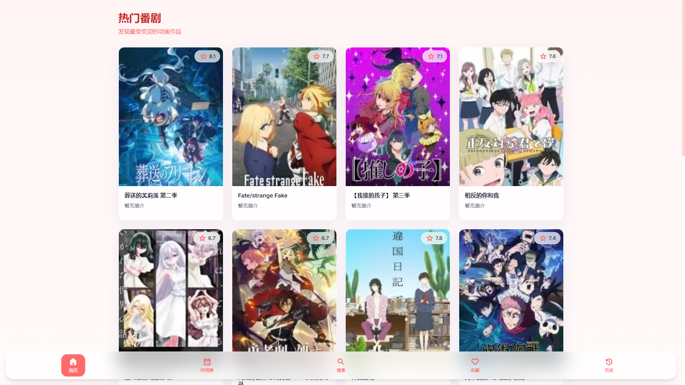
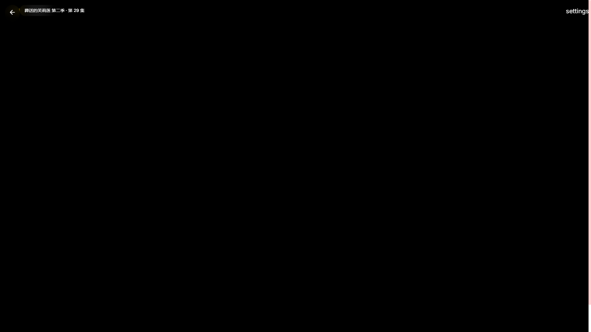

<div align="center">

# 🎬 Kazumi Web

### iOS 26 Liquid Glass 风格番剧播放器 PWA

**基于 [Kazumi](https://github.com/Predidit/Kazumi) 的 Web 重构版本**

[](https://nextjs.org/)
[](https://www.typescriptlang.org/)
[](https://tailwindcss.com/)
[](https://web.dev/progressive-web-apps/)

[](https://github.com/Predidit/Kazumi/stargazers)
[](https://github.com/Predidit/Kazumi/network/members)
[](https://github.com/Predidit/Kazumi/issues)
[](./LICENSE)

[English](#english) | [简体中文](#简体中文)




</div>

---

## ✨ 特性

<table>
<tr>
<td width="50%">

### 🎨 iOS 26 液态玻璃设计
- 毛玻璃模糊效果
- 动态光影与折射
- 流畅的过渡动画
- 深色/浅色主题自适应

</td>
<td width="50%">

### 📱 PWA 原生体验
- 添加到主屏幕
- 离线缓存支持
- 全屏沉浸式播放
- iOS Safari 完美适配

</td>
</tr>
<tr>
<td width="50%">

### 🎬 强大的播放功能
- HLS/MP4/FLV 多格式支持
- 弹幕系统 (弹弹Play)
- 手势控制 (音量/亮度/进度)
- 倍速播放 (0.5x - 3.0x)
- 画中画模式

</td>
<td width="50%">

### 🔌 插件化视频源
- 兼容 Kazumi 原版插件
- 多视频源切换
- 自动解析视频地址
- Puppeteer 无头浏览器解析

</td>
</tr>
</table>

---

## 🚀 快速开始

### 在线体验

> 🔗 **Demo**: [https://kazumi-web.vercel.app](https://kazumi-web.vercel.app) *(部署后替换)*

### 本地开发

```bash
# 克隆仓库
git clone https://github.com/Predidit/Kazumi.git
cd Kazumi/ios-liquid-glass-video-player

# 安装依赖
npm install

# 启动开发服务器
npm run dev
```

访问 http://localhost:3000

### Docker 部署

```bash
# 使用 Docker Compose
docker-compose up -d

# 或直接使用 Docker
docker build -t kazumi-web .
docker run -d -p 3000:3000 --shm-size=2g kazumi-web
```

> ⚠️ **注意**: 视频解析需要 Chromium，请确保分配至少 **2GB 内存**

---

## 📦 技术栈

<div align="center">

| 类别 | 技术 |
|:---:|:---:|
| **框架** |   |
| **语言** |  |
| **样式** |  |
| **状态管理** |  |
| **视频播放** |  |
| **视频解析** |  |
| **容器化** |  |

</div>

---

## 🏗️ 项目结构

```
ios-liquid-glass-video-player/
├── app/                    # Next.js App Router
│   ├── api/               # API 路由
│   │   ├── bangumi/       # Bangumi API 代理
│   │   ├── dandanplay/    # 弹弹Play API
│   │   ├── plugins/       # 插件 API (搜索/解析)
│   │   └── proxy/         # 视频/图片代理
│   ├── anime/[id]/        # 番剧详情页
│   ├── calendar/          # 时间表页
│   ├── favorites/         # 收藏页
│   ├── history/           # 历史记录页
│   ├── search/            # 搜索页
│   └── settings/          # 设置页
├── components/            # React 组件
│   ├── anime/            # 番剧相关组件
│   ├── player/           # 播放器组件
│   ├── ui/               # 通用 UI 组件
│   └── layout/           # 布局组件
├── lib/                   # 工具库
│   ├── api/              # API 客户端
│   ├── hooks/            # React Hooks
│   ├── storage/          # 本地存储
│   └── utils/            # 工具函数
├── public/               # 静态资源
│   └── plugins/          # 插件配置
├── styles/               # 全局样式
└── types/                # TypeScript 类型
```

---

## 🎯 功能对比

| 功能 | Kazumi (Flutter) | Kazumi Web (PWA) |
|:---|:---:|:---:|
| iOS 支持 | ✅ 原生 | ✅ PWA |
| Android 支持 | ✅ 原生 | ✅ PWA |
| Windows/macOS/Linux | ✅ 原生 | ✅ 浏览器 |
| 弹幕系统 | ✅ | ✅ |
| 插件系统 | ✅ | ✅ 兼容 |
| 离线播放 | ✅ | ⚠️ 有限支持 |
| 硬件解码 | ✅ | ✅ 浏览器原生 |
| 超分辨率 | ✅ Anime4K | ✅ WebGPU |
| 安装包大小 | ~50MB | 0 (PWA) |

---

## 🔧 配置说明

### 环境变量

| 变量 | 说明 | 默认值 |
|:---|:---|:---|
| `NODE_ENV` | 运行环境 | `development` |
| `PUPPETEER_EXECUTABLE_PATH` | Chromium 路径 | 自动检测 |

### 插件配置

插件配置文件位于 `public/plugins/index.json`，格式与 Kazumi 原版兼容：

```json
[
  {
    "name": "插件名称",
    "baseURL": "https://example.com",
    "useNativePlayer": true,
    "useLegacyParser": false,
    "referer": "https://example.com/",
    "userAgent": "Mozilla/5.0 ..."
  }
]
```

---

## 🤝 贡献指南

欢迎提交 Pull Request！

1. Fork 本仓库
2. 创建特性分支 (`git checkout -b feature/AmazingFeature`)
3. 提交更改 (`git commit -m 'Add some AmazingFeature'`)
4. 推送到分支 (`git push origin feature/AmazingFeature`)
5. 提交 Pull Request

### 开发规范

- 使用 TypeScript 严格模式
- 遵循 ESLint + Prettier 规范
- 组件使用函数式 + Hooks
- 提交信息遵循 [Conventional Commits](https://www.conventionalcommits.org/)

---

## 📄 许可证

本项目基于 [GPL-3.0 License](./LICENSE) 开源。

---

## 🙏 致谢

- [Kazumi](https://github.com/Predidit/Kazumi) - 原版 Flutter 应用
- [Bangumi](https://bgm.tv/) - 番剧数据 API
- [弹弹Play](https://www.dandanplay.com/) - 弹幕数据 API
- [Next.js](https://nextjs.org/) - React 框架
- [Tailwind CSS](https://tailwindcss.com/) - CSS 框架

---

<div align="center">

**如果这个项目对你有帮助，请给一个 ⭐ Star！**

[](https://star-history.com/#Predidit/Kazumi&Date)

Made with ❤️ by [Kazumi Contributors](https://github.com/Predidit/Kazumi/graphs/contributors)

</div>

---

<a name="english"></a>
## English

### Kazumi Web - iOS 26 Liquid Glass Style Anime Player PWA

A Progressive Web App reimplementation of [Kazumi](https://github.com/Predidit/Kazumi) with iOS 26 Liquid Glass design aesthetics.

#### Features

- 🎨 **iOS 26 Liquid Glass UI** - Glassmorphism effects with dynamic blur and refraction
- 📱 **PWA Ready** - Install on any device, works offline
- 🎬 **Full-featured Player** - HLS/MP4 support, danmaku, gesture controls
- 🔌 **Plugin Compatible** - Works with existing Kazumi plugins
- 🐳 **Docker Ready** - Easy deployment with Puppeteer support

#### Quick Start

```bash
# Clone and install
git clone https://github.com/Predidit/Kazumi.git
cd Kazumi/ios-liquid-glass-video-player
npm install
npm run dev
```

#### Docker Deployment

```bash
docker-compose up -d
```

> ⚠️ Requires at least **2GB RAM** for Chromium-based video parsing.

See [DEPLOY.md](./DEPLOY.md) for detailed deployment instructions.
